<h1>Enterprise RBAC Application</h1>

This is a full-stack internal enterprise application with role-based access control (RBAC), multi-organization and multi-entity support.

<h2>📦 Tech Stack</h2>
<ul>
  <li><b>Frontend:</b> Next.js, React, Material UI, Next-auth</li>
  <li><b>Backend:</b> Node.js, Fastify, TypeORM, MySQL</li>
</ul>

## 🔧 Architecture (Simplified)

```mermaid
flowchart TD
%% ------------------- Browser Layer -------------------
subgraph Browser["🧑‍💻 Browser"]
A["React Components + MUI"]
A2["Next.js Pages"]
B["REST API → Axios"]
end

%% ------------------- Next.js Server -------------------
subgraph NextJS_Server["🌐 Next.js Server"]
C["SessionProvider → next-auth"]
C2["API Route → Proxy to Backend"]
C1["Page Route → Serve HTML/CSS/JS"]
end

%% ------------------- Fastify Server -------------------
subgraph Fastify["🚀 Fastify Backend"]
D["Auth Check → JWT"]
F["RBAC Check"]
G["Route Handlers"]
H["TypeORM Repositories"]
I["Pino Logger"]
end

%% ----- Flow Arrows -----
    A --> B & A2
    A2 --> C
    B --> C
    C --> C2 & C1
    C2 --> D
    D --> F
    F --> G --> H & I
    H --> J[("MySQL DB")]
    I --> K["logs/app.log"]
```

<h2>🧩 Features</h2>
<ul>
  <li>Dynamic roles and permission-based menu/actions</li>
  <li>Organizations and entity scoping (multi-tenant)</li>
  <li>Soft delete model (status = A/D)</li>
  <li>Audit logging for all write actions</li>
  <li>Reverse proxy: Next.js server handles static + proxies API</li>
</ul>

<h2>📥 Installation</h2>
<ol>
  <li>Install dependencies:
    <pre><code>
    cd frontend
    npm install</code></pre>
     <pre><code>
    cd backend
    npm install</code></pre>
  </li>
  <li>Create <code>.env</code> with DB, JWT_SECRET, PORT, etc. from .env.example</li>
  <li>Start backend and frontend:
    <pre><code>npm run dev</code></pre>
  </li>
</ol>

<h2>📋 License</h2>

MIT licensed.

